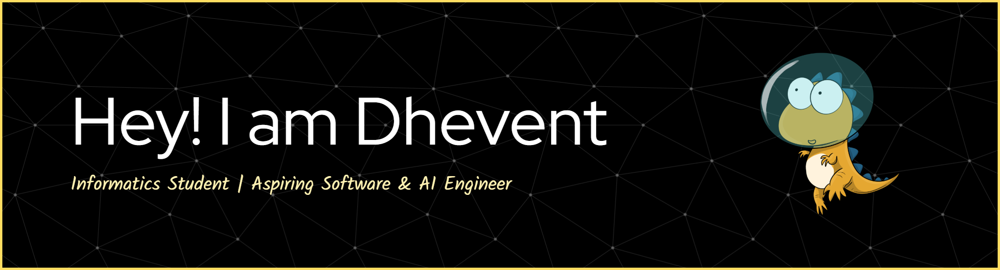

#### About
I'm an Informatics student passionate about Software Engineering and Artificial Intelligence. I love building cross-platform mobile apps with Flutter, exploring machine learning models (NLP & Computer Vision) using Python, and experimenting with game mechanics. Always eager to learn new technologies, write clean code, and build smart software solutions.
